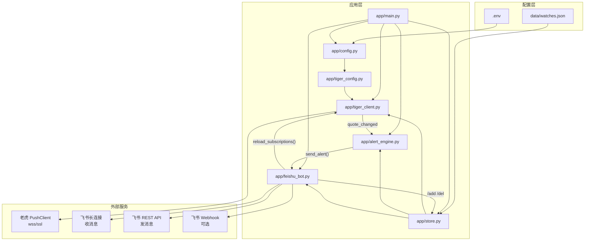

# getStockPrice 功能与实现说明

> 文档版本：2026-07-09  
> 用途：供审阅、修改需求与二次开发参考

---

## 1. 项目概述

本项目是一个 **Python 后端常驻服务**，核心能力：

1. 通过 **老虎证券 Open API** 订阅股票实时行情（WebSocket Push）
2. 当价格相对 **当日开盘价** 涨跌幅度超过设定阈值时，向 **飞书** 发送提醒
3. 用户可在飞书对话中 **增删监控股票、修改提醒百分比**
4. 所有配置通过 **`.env` 环境变量** 管理，监控列表持久化到本地 JSON

### 技术栈

| 组件 | 库/服务 |
| --- | --- |
| 语言 | Python 3.10+ |
| 行情 | `tigeropen`（老虎 PushClient） |
| 即时通信 | `lark-oapi`（飞书长连接 + REST 发消息） |
| 配置 | `python-dotenv` |
| HTTP | `requests`（飞书 Webhook 可选） |

### 启动方式

```bash
python -m app.main
```

---

## 2. 系统架构



### 运行时线程模型

| 线程 | 来源 | 职责 |
| --- | --- | --- |
| 主线程 | `main.py` | 初始化组件、注册信号、阻塞等待退出 |
| `feishu-ws` | `FeishuBot.start()` | 飞书长连接，接收用户命令 |
| 老虎 SDK 内部线程 | `PushClient` | 维护行情 WebSocket、回调 `quote_changed` |
| 老虎回调线程池 | `CallbackThreadPoolExecutor` | 执行行情/连接回调（与主线程并发） |

> 注意：`WatchStore` 与 `AlertEngine` 内部使用锁保证线程安全。

---

## 3. 目录与模块职责

```
getStockPrice/
├── app/
│   ├── main.py           # 入口：组装各模块、信号处理、启动/停止
│   ├── config.py         # 读取 .env，构造 Settings 数据类
│   ├── tiger_config.py   # 构建老虎 TigerOpenClientConfig
│   ├── tiger_client.py   # 老虎 PushClient 封装：连接、订阅、行情回调
│   ├── store.py          # 监控列表 CRUD + 代码格式转换
│   ├── alert_engine.py   # 涨跌幅判定 + 冷却 + 组装告警文案
│   └── feishu_bot.py     # 飞书收发消息 + 命令解析
├── data/
│   └── watches.json      # 运行时生成，监控列表持久化
├── secrets/              # 建议放私钥，已在 .gitignore
├── docs/
│   └── 功能与实现说明.md  # 本文档
├── .env.example
├── requirements.txt
└── README.md
```

---

## 4. 核心数据流

### 4.1 行情 → 告警

```
老虎 PushClient 推送 QuoteBasicData
    ↓
TigerQuoteClient._on_quote_changed()
    ↓ 解析 latestPrice / open / preClose / high / low
    ↓ 通过 symbol 反查 WatchStore.get_by_tiger_symbol()
    ↓ 构造 QuoteSnapshot
AlertEngine.on_quote()
    ↓ 计算相对开盘涨跌幅
    ↓ 与 WatchItem.percent 比较
    ↓ 冷却去重（同方向、同日、冷却期内不重复发）
FeishuBot.send_alert()
    ↓ 发到 FEISHU_ALERT_CHAT_ID 或最近命令会话
    ↓ 可选同时发 Webhook
```

### 4.2 飞书命令 → 订阅变更

```
飞书用户发送文本消息
    ↓
FeishuBot._on_message() 解析命令
    ↓
WatchStore.add() / remove() / set_percent()
    ↓ 写入 data/watches.json
TigerQuoteClient.reload_subscriptions()
    ↓ 增量 unsubscribe / subscribe
```

---

## 5. 告警逻辑（`alert_engine.py`）

### 5.1 触发条件

相对当日开盘价涨跌幅：

```
pct = (最新价 - 开盘价) / 开盘价 × 100%
```

当 `|pct| >= 阈值` 时触发告警。阈值为正数，取绝对值比较。

### 5.2 不触发的情况

- 股票不在监控列表中
- `open <= 0` 或 `last <= 0`（非交易时段、数据未就绪）
- `|pct| < 阈值`

### 5.3 冷却机制

防止同一方向短时间内重复刷屏：

| 字段 | 说明 |
| --- | --- |
| `direction` | `up`（上涨）或 `down`（下跌） |
| `day` | 触发日期（`date.today()`） |
| `at` | 上次触发时间戳 |

规则：**同一股票、同一自然日、同一方向**，在 `ALERT_COOLDOWN_SECONDS`（默认 300 秒）内不重复告警。

> 跨日后冷却状态按日期自然失效（因 `same_day` 为 false）。  
> 方向反转（由涨变跌）可立即触发新告警。

### 5.4 告警消息格式示例

```
【股价提醒】AAPL.US ↑
最新价: 230.5
开盘价: 225.0
相对开盘: +2.44%（阈值 2%）
昨收: 224.8
相对昨收: +2.54%
日内高低: 231.0 / 224.5
```

---

## 6. 监控列表（`store.py`）

### 6.1 数据结构

`WatchItem`：

| 字段 | 类型 | 说明 |
| --- | --- | --- |
| `code` | str | 股票代码，存为大写 |
| `region` | str | 市场：`US` / `HK` / `CN` |
| `percent` | float | 告警阈值（%） |

唯一键：`{code}${region}`，例如 `AAPL$US`。

### 6.2 持久化格式（`data/watches.json`）

```json
[
  {
    "code": "AAPL",
    "region": "US",
    "percent": 2.5
  },
  {
    "code": "700",
    "region": "HK",
    "percent": 3.0
  }
]
```

### 6.3 股票代码 → 老虎订阅代码

| 市场 | 用户输入 | 老虎 `subscribe_quote` 代码 | 转换规则 |
| --- | --- | --- | --- |
| US | `AAPL` | `AAPL` | 原样大写 |
| HK | `700` | `00700` | `zfill(5)` 左侧补零 |
| CN | `600519` | `600519` | 原样大写 |

函数：`to_tiger_symbol(code, region)` / `WatchItem.tiger_symbol`。

### 6.4 数量上限

- 本地限制：`MAX_WATCHES`（默认 30）
- 超出时 `add()` 抛出 `ValueError`，飞书机器人返回错误提示
- 实际上限还受老虎行情套餐订阅数限制

---

## 7. 老虎证券接入（`tiger_client.py` + `tiger_config.py`）

### 7.1 凭证配置（二选一）

**方式 A：配置文件目录（推荐）**

```env
TIGER_PROPS_PATH=./tiger_config
```

目录内需包含：

- `tiger_openapi_config.properties`（开发者页面导出）
- 港股牌照 TBHK 还需：`tiger_openapi_token.properties`

**方式 B：逐项环境变量**

```env
TIGER_ID=...
TIGER_ACCOUNT=...
TIGER_LICENSE=TBHK
TIGER_PRIVATE_KEY_PATH=./secrets/private_key.pem
# 或 TIGER_PRIVATE_KEY=...（私钥内容）
```

可选：

```env
TIGER_SECRET_KEY=...   # 机构账户
TIGER_SANDBOX=false    # true 连接沙箱
```

### 7.2 PushClient 初始化

```python
PushClient(host, port, use_ssl=True, use_protobuf=True, client_config=...)
push_client.connect(tiger_id, private_key)
```

- `host/port` 来自 `client_config.socket_host_port`
- 使用 Protobuf 协议接收 `QuoteBasicData`

### 7.3 注册的回调

| 回调 | 作用 |
| --- | --- |
| `connect_callback` | 连接成功后订阅当前全部 `tiger_symbols()` |
| `quote_changed` | 收到基本行情，转交 `AlertEngine` |
| `subscribe_callback` | 记录订阅结果，失败时通知 |
| `error_callback` | 记录行情错误 |

> **未设置 `disconnect_callback`**：保留 SDK 默认断线自动重连行为；重连后 `connect_callback` 会重新订阅。

### 7.4 订阅管理

| 时机 | 行为 |
| --- | --- |
| 首次连接 | `subscribe_quote(全部 symbols)` |
| `/add` 或 `/del` | `reload_subscriptions()` 增量更新 |
| 服务停止 | `unsubscribe_quote` + `disconnect` |

`reload_subscriptions()` 逻辑：

```
to_remove = 已订阅 - 新列表
to_add    = 新列表 - 已订阅
```

### 7.5 使用的行情字段

来自 `QuoteBasicData`（Protobuf）：

| 字段 | 用途 |
| --- | --- |
| `symbol` | 反查监控项 |
| `latestPrice` | 最新价 |
| `open` | 开盘价（告警基准） |
| `preClose` | 昨收（展示 + 计算相对昨收%） |
| `high` / `low` | 日内高低（展示） |
| `timestamp` | 时间戳 |

通过 `HasField()` 判断字段是否存在，避免 proto3 默认值误判。

---

## 8. 飞书机器人（`feishu_bot.py`）

### 8.1 接入方式

- **收消息**：飞书 SDK 长连接（`lark.ws.Client`），无需公网 IP
- **发消息**：REST API `im.v1.message.create`
- **可选推送**：群自定义机器人 Webhook（仅发不收）

### 8.2 告警发送优先级

1. 若配置了 `FEISHU_ALERT_CHAT_ID` → 发到该会话
2. 否则发到用户最近一次发命令的 `chat_id`（`_last_command_chat_id`）
3. 若配置了 `FEISHU_WEBHOOK_URL` → 同时推送 Webhook
4. 以上皆无 → 打 error 日志，告警丢失

### 8.3 支持的命令

| 命令 | 语法 | 说明 |
| --- | --- | --- |
| `/add` | `/add <代码> <市场> [百分比]` | 添加监控，省略百分比用 `DEFAULT_ALERT_PERCENT` |
| `/del` | `/del <代码> <市场>` | 删除监控并刷新订阅 |
| `/set` | `/set <代码> <市场> <百分比>` | 仅改阈值，不刷新订阅 |
| `/list` | `/list` | 列出当前监控 |
| `/chatid` | `/chatid` | 返回当前会话 ID |
| `/help` | `/help` | 显示帮助 |

别名：`add`、`help`、`帮助`、`list`、`chatid` 等（见代码中的集合判断）。

### 8.4 消息预处理

- 仅处理 `message_type == "text"`
- 去除群内 `@_user_xxx` 前缀（正则 `@_user_\d+\s*`）

### 8.5 飞书应用侧必要配置

1. 企业自建应用 + 机器人能力
2. 权限：`im:message:send_as_bot`、`im:message.p2p_msg:readonly`、`im:message.group_at_msg:readonly`
3. 事件：`im.message.receive_v1`，订阅方式选 **长连接**
4. 应用发布；本地先启动服务建立长连接，再在后台保存订阅配置

---

## 9. 环境变量完整说明

| 变量 | 必填 | 默认值 | 说明 |
| --- | --- | --- | --- |
| `TIGER_PROPS_PATH` | 二选一 | - | 老虎配置文件目录 |
| `TIGER_ID` | 方式 B 必填 | - | 开发者 Tiger ID |
| `TIGER_ACCOUNT` | 方式 B 必填 | - | 资金账号 |
| `TIGER_LICENSE` | 建议 | - | 牌照 TBHK/TBSG 等 |
| `TIGER_PRIVATE_KEY_PATH` | 方式 B | - | PKCS#1 私钥 PEM 路径 |
| `TIGER_PRIVATE_KEY` | 方式 B | - | 私钥内容（与 PATH 二选一） |
| `TIGER_SECRET_KEY` | 机构 | - | 机构用户密钥 |
| `TIGER_SANDBOX` | 否 | `false` | 是否沙箱 |
| `MAX_WATCHES` | 否 | `30` | 本地监控上限 |
| `FEISHU_APP_ID` | **是** | - | 飞书应用 ID |
| `FEISHU_APP_SECRET` | **是** | - | 飞书应用密钥 |
| `FEISHU_ALERT_CHAT_ID` | 建议 | - | 默认告警会话 |
| `FEISHU_ALERT_RECEIVE_ID_TYPE` | 否 | `chat_id` | 接收 ID 类型 |
| `FEISHU_WEBHOOK_URL` | 否 | - | 群 Webhook |
| `DEFAULT_ALERT_PERCENT` | 否 | `2.0` | 默认阈值 % |
| `ALERT_COOLDOWN_SECONDS` | 否 | `300` | 同向冷却秒数 |
| `DATA_FILE` | 否 | `./data/watches.json` | 监控列表路径 |
| `LOG_LEVEL` | 否 | `INFO` | 日志级别 |

---

## 10. 启动与退出（`main.py`）

### 10.1 启动顺序

```
load_settings()
  → WatchStore（加载 JSON）
  → FeishuBot（注入 get_quote_client 回调）
  → AlertEngine（注入 send_alert = bot.send_alert）
  → TigerQuoteClient
  → bot.start()      # 飞书长连接线程
  → tiger.start()    # 老虎 Push 连接
  → 主循环 sleep
```

### 10.2 优雅退出

捕获 `SIGINT` / `SIGTERM`：

1. 设置 `stop_event`
2. 调用 `tiger.stop()`（退订 + 断开）
3. 主循环退出，进程结束

> 飞书长连接线程为 daemon，随主进程退出。

---

## 11. 已知限制与注意事项

| 项目 | 说明 |
| --- | --- |
| 行情权限 | Open API 实时行情需**单独购买**，与 APP 行情独立 |
| 延迟行情 | 未购买实时权限时推送可能是延迟数据 |
| 告警基准 | 固定为**相对开盘价**，不支持相对昨收/加仓价等（可扩展） |
| `/set` 不刷新订阅 | 改阈值不需要重新订阅老虎行情 |
| 飞书长连接 | 单应用最多 50 连接；集群模式随机一台收到消息 |
| 事件处理时限 | 飞书要求 3 秒内处理完事件回调 |
| A 股市场 | 命令层面支持 `CN`，实际能否订阅取决于老虎账号行情权限 |
| 时区 | 冷却使用服务器本地 `date.today()`，跨时区部署需注意 |

---

## 12. 常见修改入口

若你要调整行为，可参考以下入口：

| 需求 | 建议修改文件 |
| --- | --- |
| 改告警基准（如相对昨收） | `alert_engine.py` → `open_change_percent` / `on_quote()` |
| 改冷却策略 | `alert_engine.py` → `_last_alerts` 逻辑 |
| 改告警文案 | `alert_engine.py` → `on_quote()` 中 `lines` |
| 新增飞书命令 | `feishu_bot.py` → `_handle_command()` |
| 改股票代码规则 | `store.py` → `to_tiger_symbol()` |
| 换行情源 | 新建 client 模块，替换 `tiger_client.py` |
| 换 IM（钉钉/企微等） | 新建 bot 模块，替换 `feishu_bot.py` |
| 改持久化（SQLite/Redis） | `store.py` |
| 新增环境变量 | `config.py` + `.env.example` + 本文档 |

---

## 13. 依赖版本（`requirements.txt`）

```
python-dotenv>=1.0.1
tigeropen>=3.0.0
lark-oapi>=1.4.0
requests>=2.32.0
```

---

## 14. 历史变更摘要

| 阶段 | 行情源 | 说明 |
| --- | --- | --- |
| v1 | iTick WebSocket | 免费版限 3 只订阅 |
| **当前** | 老虎证券 PushClient | 支持 US/HK/CN，订阅上限由套餐决定 |

---

## 15. 待扩展想法（未实现）

以下为文档记录，**代码中尚未实现**，供你审阅时勾选或补充：

- [ ] 相对昨收 / 相对加仓成本 作为告警基准
- [ ] 阶梯提醒（每再涨跌 X% 提醒一次）
- [ ] 交易时段过滤（盘前盘后不提醒）
- [ ] 多群/多用户告警路由
- [ ] HTTP 管理接口或 Web 面板
- [ ] 告警历史记录与统计
- [ ] 健康检查端点（/health）
- [ ] Docker 部署配置

---

*如有修改需求，可直接在本文档标注，或说明要改的章节编号。*
